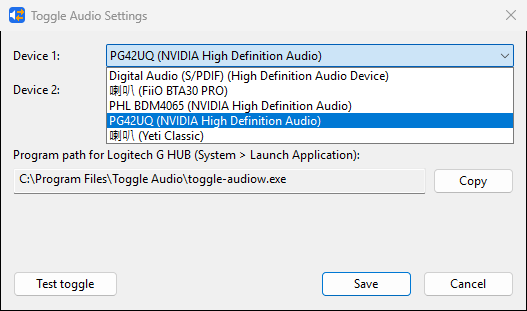

# Toggle Audio

**Flip Windows audio output between two devices in milliseconds: one tiny exe, perfect for a hotkey.**

[](https://github.com/hotdogee/toggle-audio/actions/workflows/ci.yml)
[](https://github.com/hotdogee/toggle-audio/releases)
[](LICENSE)
[](#compatibility)

Toggle Audio does one thing: each run switches the Windows default playback device between the two outputs you picked (say, speakers and headphones), then exits. It is a native x64 executable with no runtime, no tray icon and no background process, made to sit behind a macro key in Logitech G HUB, Stream Deck, AutoHotkey or a Windows shortcut. A full toggle takes **40 ms** (median), against **887 ms** for the PowerShell script packaged with ps2exe that it replaces, which makes it **about 22 times faster**. Listing the devices takes 19 ms. Measured on a Ryzen 9 7950X with Windows 11 (build 26300); see [Performance](#performance).



## Contents

- [Features](#features)
- [Install](#install)
- [Quick start: bind a hotkey](#quick-start-bind-a-hotkey)
- [Which exe to bind](#which-exe-to-bind)
- [Command line](#command-line)
- [Configuration](#configuration)
- [How it works](#how-it-works)
- [Performance](#performance)
- [Compatibility](#compatibility)
- [Troubleshooting](#troubleshooting)
- [Related tools](#related-tools)
- [Contributing](#contributing), [License](#license), [Acknowledgments](#acknowledgments)

## Features

- **Fast.** About 40 ms per toggle, most of which Windows itself spends switching the device. There is no runtime start-up to wait for.
- **Nothing running in the background.** It runs, switches and exits. No tray icon, no service, no startup entry.
- **No dependencies.** Two native x64 exes of about 520 KB each, with the C runtime linked in statically. No .NET, no PowerShell modules, no VC++ redistributable.
- **Small settings dialog.** Pick Device 1 and Device 2 from your active playback devices by the names Sound settings shows (Unicode names such as `喇叭 (FiiO BTA30 PRO)` included), try the toggle, and copy the program path for your launcher.
- **Stable across renames.** It stores endpoint ids rather than names, so renaming a device or changing the Windows display language doesn't break the setting.
- **Handles unplugged devices.** When the device it would switch to is not connected, it falls back to the other one if it can. When neither is available it reports an error instead of failing silently.
- **All roles.** It sets the Console and Multimedia defaults, and the Communications default too unless you turn that off (voice-chat apps often play through the Communications device).
- **No console window** when a launcher starts it ([details](#which-exe-to-bind)). Errors from a hotkey press appear in a message box.
- **Scriptable.** `list`, `get` and `set` commands, documented exit codes, and UTF-8 output when redirected.
- **MSI installer** for `C:\Program Files\Toggle Audio\`, with a Start Menu entry, optional PATH entry, upgrades and a clean uninstall. A portable zip is also available.

## Install

### MSI installer (recommended)

1. Download `toggle-audio-<version>-x64.msi` from [GitHub Releases](https://github.com/hotdogee/toggle-audio/releases).
2. Optional: check the download (see below).
3. Run it. It installs for all users into `C:\Program Files\Toggle Audio\`, so Windows asks for administrator approval once. You get:
   - **Toggle Audio Settings** in the Start Menu;
   - `toggle-audio` and `toggle-audiow` registered with Win+R;
   - the install folder on the system `PATH` (the **Add to PATH** feature, on by default; you can turn it off in the Custom Setup step).

> [!NOTE]
> The binaries and the MSI are **not code-signed yet**. SmartScreen may say "Windows protected your PC": click **More info**, then **Run anyway**. The UAC prompt shows "Publisher: Unknown".

**Verify the download.** Each release publishes `SHA256SUMS.txt` next to the MSI and the zip. The two values must match:

```powershell
(Get-FileHash .\toggle-audio-0.1.0-x64.msi -Algorithm SHA256).Hash.ToLower()
Select-String toggle-audio-0.1.0-x64.msi .\SHA256SUMS.txt
```

For silent installs (`msiexec /i toggle-audio-0.1.0-x64.msi /qn` from an elevated terminal), installing without the PATH entry, upgrades and uninstalling, see [docs/packaging.md](docs/packaging.md). Your settings in `%APPDATA%\toggle-audio\` are kept on upgrade and uninstall.

### Portable zip

`toggle-audio-<version>-x64.zip` on the same Releases page contains `toggle-audio.exe`, `toggle-audiow.exe`, `LICENSE`, `THIRD-PARTY-NOTICES.txt` and this README. Unzip it to a folder of your choice, for example `%LOCALAPPDATA%\Programs\Toggle Audio`, and run `toggle-audiow.exe settings`. Nothing is registered, and to remove it you delete the folder (and `%APPDATA%\toggle-audio\` if you want). Verify the zip against `SHA256SUMS.txt` the same way as the MSI.

### Build from source

You need Rust 1.85 or later and the Visual Studio 2022 Build Tools (Desktop development with C++, plus a Windows SDK). [CONTRIBUTING.md](CONTRIBUTING.md#development-setup-windows) lists them.

```powershell
git clone https://github.com/hotdogee/toggle-audio
cd toggle-audio
cargo build --release
.\target\release\toggle-audiow.exe settings
```

Both exes end up in `target\release\`. To build the MSI as well, see [docs/packaging.md](docs/packaging.md#building-the-msi).

### winget

Submitted to microsoft/winget-pkgs as `Hotdogee.ToggleAudio` ([pull request #446595](https://github.com/microsoft/winget-pkgs/pull/446595)). Once it is merged:

```powershell
winget install Hotdogee.ToggleAudio
```

The manifests are kept in [`installer/winget/`](installer/winget/), and the [`winget` workflow](.github/workflows/winget.yml) submits each new release automatically.

## Quick start: bind a hotkey

1. **Open Settings.** Use **Toggle Audio Settings** in the Start Menu, or run `toggle-audio settings`.
2. **Choose the two devices.** Device 1 and Device 2 list the playback devices that are active right now.
3. **Communications.** Leave **Also switch the Communications device** ticked if voice apps should follow the switch too.
4. **Test toggle** switches with the selections shown, even before you save. Press it again to switch back.
5. **Copy** puts the program path on the clipboard, for example `C:\Program Files\Toggle Audio\toggle-audiow.exe`. It is the path of the exe that Settings runs from, and from the Start Menu that is `toggle-audiow.exe`, which suits every launcher ([why](#which-exe-to-bind)).
6. **Save.** The dialog closes and the choice is written to `%APPDATA%\toggle-audio\config.json`. You can open Settings again at any time, also just to copy the path.

### Logitech G HUB

1. Open G HUB, click your keyboard (or mouse) and open **Assignments**.
2. Select the **System** tab. Under **Launch Application**, click **Add Application**.
3. Fill in the fields:
   - **Name**: `Toggle Audio`
   - **Path**: paste the path from Copy, without quotes (it is labeled "Program path for Logitech G HUB" in the settings dialog). You can also browse to `C:\Program Files\Toggle Audio\toggle-audiow.exe`.
   - **Arguments**: leave empty, because toggling is the default command.
4. Save, then drag the new **Toggle Audio** entry onto a G key. You can also click the key so it is highlighted and then double-click the entry.
5. Press the key. The default output switches, and no window appears.

Tips:

- G HUB assignments belong to the active profile. To make the key work in every game too, lock the assignments (persistent across profiles) or add the entry to each profile.
- A second Launch Application entry with **Arguments** `settings` gives you a key that opens the settings dialog.
- G HUB has moved these buttons around between versions. If yours looks different, look for "Launch Application" in the System tab.

### Other launchers

| Launcher | How |
| --- | --- |
| Stream Deck | Add a **System > Open** action and set **App / File** to the program path. |
| AutoHotkey v2 | `F13::Run '"C:\Program Files\Toggle Audio\toggle-audiow.exe"'` |
| Windows shortcut | Create a shortcut to `toggle-audiow.exe` on the desktop or in the Start Menu. Then open **Properties > Shortcut key** and press a combination such as Ctrl+Alt+A. |

## Which exe to bind

There are two exes with the same features, like `python.exe` and `pythonw.exe`:

| Exe | Subsystem | Use it for |
| --- | --- | --- |
| `toggle-audio.exe` | Console, with `consoleAllocationPolicy = detached` in its manifest | Terminals and scripts. Shells wait for it and can capture its output and exit code. On **Windows 11 24H2 and later**, a launch from G HUB, Explorer or a shortcut creates no console window either. |
| `toggle-audiow.exe` | Windows (GUI) | Hotkeys on **any** Windows version, and the Start Menu Settings shortcut. It never creates a console. When run from a terminal, it attaches to that terminal for best-effort output. |

- **Windows 11 24H2 or later:** either exe is fine for a hotkey.
- **Windows 10, or Windows 11 before 24H2:** those versions ignore the `consoleAllocationPolicy` manifest setting, so a hotkey launch of `toggle-audio.exe` opens a console window for a moment. Bind `toggle-audiow.exe` instead.
- **Scripts:** use `toggle-audio.exe`. PowerShell does not wait for a GUI-subsystem exe, so it cannot reliably capture the output or the exit code of `toggle-audiow.exe`. `cmd /c` and batch files do wait for it.

The two are equally fast (see the [benchmarks](docs/benchmarks.md#g-hub-launch-console-allocation)).

## Command line

`toggle-audio --help` prints:

```text
toggle-audio 0.1.0
Flip the Windows default playback device between two configured devices.

Usage:
  toggle-audio [toggle]          Toggle between Device 1 and Device 2
                                 (chosen in Settings)
  toggle-audio list              List active playback devices:
                                 <id> TAB <name> TAB <flags>, where flags are
                                 * default, c default communications, - neither
  toggle-audio get               Print the default playback device:
                                 <id> TAB <name>
  toggle-audio set <id-or-name>  Make a device the default (id, exact name or
                                 unique part of a name)
  toggle-audio settings          Open the settings dialog
                                 (aliases: --settings, config, gui)
  toggle-audio --help | -h       Show this help
  toggle-audio --version | -V    Show the version

Options:
  --timing                       Print per-phase timings (microseconds since
                                 process start) to stderr
  --comm | --no-comm             Also / do not switch the default
                                 communications device this time
  --                             Stop reading options (for a device name
                                 that starts with -)

Configuration: %APPDATA%\toggle-audio\config.json

Exit codes:
  0  success
  1  unexpected error
  2  usage error
  3  no or invalid configuration
  4  device not found, not active, or the name matches several devices
```

| Exit code | Meaning | Typical cause |
| ---: | --- | --- |
| 0 | success | |
| 1 | unexpected error | A Core Audio (COM) call failed (the HRESULT is in the message), or the configuration could not be written. |
| 2 | usage error | Unknown command or option, `set` without a device, or `--comm` together with `--no-comm`. |
| 3 | no or invalid configuration | `toggle` before Device 1 and Device 2 were saved, or a broken `config.json`. Run `toggle-audio settings`. |
| 4 | device not found, not active, or the name matches several devices | Neither configured device can be used, the `set` argument matches no active playback device, a partial name matches more than one device (the message lists the matches), or Windows has no default playback device. |

Examples:

```console
> toggle-audio
Switched to 喇叭 (FiiO BTA30 PRO)

> toggle-audio list
{0.0.0.00000000}.{0b317ab3-7e08-4d56-975a-f33b90d5b57a}	Digital Audio (S/PDIF) (High Definition Audio Device)	-
{0.0.0.00000000}.{30045f40-8cfd-4441-bb89-0d13fc19b589}	喇叭 (FiiO BTA30 PRO)	-
{0.0.0.00000000}.{5b124733-5d8f-428c-b83c-ee05ce6467fb}	PHL BDM4065 (NVIDIA High Definition Audio)	-
{0.0.0.00000000}.{739b3554-bfed-4d61-b407-a818b317c991}	PG42UQ (NVIDIA High Definition Audio)	*c
{0.0.0.00000000}.{94a56fa3-fba4-44c9-9eec-2003a1418ad7}	喇叭 (Yeti Classic)	-

> toggle-audio get
{0.0.0.00000000}.{739b3554-bfed-4d61-b407-a818b317c991}	PG42UQ (NVIDIA High Definition Audio)

> toggle-audio set pg42
> toggle-audio set "{0.0.0.00000000}.{739b3554-bfed-4d61-b407-a818b317c991}"
> toggle-audio --no-comm
```

- **`set`** accepts a full endpoint id, an exact friendly name, or a part of a name that matches exactly one active playback device (case-insensitive). It changes the Console and Multimedia defaults, plus Communications unless that is turned off. It never changes the default recording device.
- **Columns:** `list` and `get` separate their fields with a TAB. In the flags column, `*` marks the default device, `c` the default communications device and `-` neither.
- **Encoding:** output to a console is Unicode whatever the code page. Output to a file or a pipe is UTF-8 with `\n` line endings.
- **Silent on success:** when there is no console (a hotkey launch), a successful run shows nothing, and errors appear in a message box titled "Toggle Audio".
- **`--timing`** appends lines of the form `timing<TAB><phase><TAB><microseconds since process creation>` to stderr.

## Configuration

Settings live in `%APPDATA%\toggle-audio\config.json`, one file per Windows user. The settings dialog writes it (to a temporary file that then replaces the old one, so a crash cannot leave half a file), and you can also edit it by hand:

```json
{
  "version": 1,
  "device1": { "id": "{0.0.0.00000000}.{739b3554-bfed-4d61-b407-a818b317c991}", "name": "PG42UQ (NVIDIA High Definition Audio)" },
  "device2": { "id": "{0.0.0.00000000}.{30045f40-8cfd-4441-bb89-0d13fc19b589}", "name": "喇叭 (FiiO BTA30 PRO)" },
  "switch_communications": true
}
```

| Field | Meaning |
| --- | --- |
| `version` | Format version, currently `1`. |
| `device1.id`, `device2.id` | Endpoint ids, as printed by `toggle-audio list`. These are what the program uses. |
| `device1.name`, `device2.name` | The friendly name when the device was saved. It is for information only, used in error messages and in the dialog when the device is not connected. |
| `switch_communications` | `true` (the default when the field is missing) also switches the default communications device. `--comm` and `--no-comm` override it for one run. |

Unknown fields are ignored, and spaces around ids are trimmed.

**Ids, not names.** Windows gives every playback endpoint a stable id. Names can change: you can rename a device in Sound settings, and the "Speakers" part is translated (on a Chinese system it reads `喇叭`). The id stays the same as long as the device uses the same driver and port, so the setting survives renames and language changes. Reinstalling a driver, or plugging a USB device into another port, can create a new endpoint; then choose the device again in Settings.

**What a toggle does:**

| Current default | Result |
| --- | --- |
| Device 1 | Switches to Device 2. |
| Anything else (Device 2, a third device) | Switches to Device 1. |
| The preferred target is not connected | Switches to the other configured device if it is connected and not already the default. A terminal run also prints a warning. |
| Neither device can be used | Exits with code 4, with a message such as `nothing to switch to: "喇叭 (FiiO BTA30 PRO)" is not connected or is disabled`. A hotkey launch shows the message in a box. |

**"(not connected)".** When a saved device is unplugged, switched off or disabled, the settings dialog still shows it as `(not connected) <name>` and keeps it selected, so saving other changes does not lose it.

## How it works

Windows has no public API for changing the default audio device. Toggle Audio uses the same undocumented COM interface as the Sound control panel, SoundSwitch, AudioDeviceCmdlets and NirSoft's tools:

1. It reads `config.json`.
2. It initializes COM and creates the documented Core Audio `IMMDeviceEnumerator`.
3. It asks for the current default render endpoint for the Console role (`GetDefaultAudioEndpoint`), reading only its id.
4. It chooses the target ([table above](#configuration)) and checks that the target is an active playback endpoint (`IMMDevice::GetState`, `IMMEndpoint::GetDataFlow`). There is no full enumeration on this path.
5. It calls `IPolicyConfig::SetDefaultEndpoint` (CLSID `{870af99c-171d-4f9e-af0d-e63df40c2bc9}`) for each role that is not already set to the target: `eConsole`, `eMultimedia` and, optionally, `eCommunications`. If that interface is unavailable or fails, it falls back to the older `IPolicyConfigVista` layout.
6. It exits.

**Where the 40 ms goes.** About 24 ms are the three `SetDefaultEndpoint` calls, roughly 8 ms each, which are remote procedure calls into the Windows Audio service. The rest is process start-up (the empty-process floor is 3.4 ms) and COM initialization (about 4 ms). A C program doing the same calls takes the same time, so the floor is Windows itself. The phase breakdown is in [docs/benchmarks.md](docs/benchmarks.md#phase-breakdown).

What it does **not** do:

- It runs no background process.
- It never asks for elevation. It runs as the invoking user (`asInvoker`), and the MSI needs administrator rights only to install, change or remove it.
- It makes no network access and collects no telemetry.
- It writes nothing except its own config file, and only when you save in the dialog.

The design is in [docs/DESIGN.md](docs/DESIGN.md). The research behind the COM interface and its vtable layout is in [docs/research/core-audio-api.md](docs/research/core-audio-api.md).

## Performance

Measured on the reference machine (AMD Ryzen 9 7950X, Windows 11 build 26300, Defender on) with hyperfine; the toggle column is a real switch between two HDMI outputs. The values are medians in ms, wall time from process creation to exit:

| Implementation | Size (bytes) | `list` | `set` (no-op) | toggle |
| --- | ---: | ---: | ---: | ---: |
| **`toggle-audio.exe`** (this project, Rust) | 521,216 | 19.43 | 19.38 ¹ | **40.05** |
| `toggle-audiow.exe` (this project, GUI subsystem) | 521,216 | 19.48 | 19.53 ¹ | 42.17 |
| C reference (MSVC `/MT`) | 116,224 | 17.36 | 37.81 | 41.59 |
| Rust bench implementation | 250,368 | 16.99 | 38.54 | 43.52 |
| C# .NET 9 NativeAOT | 1,001,984 | 18.71 | 38.91 | 42.78 |
| Go | 1,530,368 | 19.52 | 39.93 | 41.56 |
| Zig (native, no libc) | 16,384 | 17.52 | 38.24 | 40.81 |
| C built by `zig cc` | 88,064 | 17.81 | 37.93 | 41.05 |
| PowerShell + AudioDeviceCmdlets, ps2exe | 48,128 | 546.25 | 273.50 | 322.17 |
| PowerShell + AudioDeviceCmdlets, `powershell.exe -File` | – | 517.35 | 263.79 | 289.10 |
| PowerShell + AudioDeviceCmdlets, `pwsh -File` | – | 731.54 | 418.59 | 435.32 |
| **Original `Switch-Audio.exe`** (ps2exe script) | 27,648 | – | – | **887.38** |

The `set` column is `set` to the device that is already the default (no-op). ¹ The product skips roles that are already set, so it makes no `SetDefaultEndpoint` calls here, while the bench implementations always make three. Compare the toggle column, where every row makes three real calls. Sizes are those of the measured builds. The current sources build 523,776-byte product executables (review changes made after the benchmark run, not re-measured) and a 48,640-byte ps2exe exe (its size follows the line endings of `ta.ps1`: the measured build used LF, a Git checkout has CRLF).

- **Every native language is equally fast.** The native rows differ by 1–4 ms, which is inside the jitter of the audio service (σ 2–4 ms). Rust was chosen for safety around the COM code and for maintainability, not for speed.
- **Why the PowerShell version takes ~900 ms.** An empty Windows PowerShell host takes about 133 ms to start and exit, a ps2exe exe needs about 200 ms to reach the first script statement, and `Import-Module AudioDeviceCmdlets` adds 47–60 ms. The biggest cost is `Get-AudioDevice -List`, which reads every property of every endpoint (playback and recording) to find one name. It costs about 300 ms per call, and the original script called it twice. The actual switch costs the same ~40 ms as everywhere else.

Full results, method and caveats are in [docs/benchmarks.md](docs/benchmarks.md). The implementations and the harness are in [bench/](bench/README.md), and the raw numbers in [bench/RESULTS.md](bench/RESULTS.md).

## Compatibility

- **Windows 10 and Windows 11, x64.** There is no ARM64 build, and the x64 build has not been tested on ARM64 Windows.
- **Console window from launchers:** the `consoleAllocationPolicy` manifest setting only takes effect on Windows 11 24H2 and later. On older versions, bind `toggle-audiow.exe` ([details](#which-exe-to-bind)).
- **Per-app output overrides:** an app that has its own output device in **Settings > System > Sound > Volume mixer** keeps playing there and does not follow the default. Set it back to "Default" to let it follow. Some apps also pick their device only when they start or when playback starts.
- **Bluetooth headsets** often show two playback endpoints: "Headphones" (stereo, high quality) and "Headset" (hands-free, mono, used while the microphone is open). Pick the **Headphones** endpoint as Device 1 or Device 2.
- **Playback only.** Toggle Audio never changes the default recording device (microphone).

## Troubleshooting

| Symptom | What to do |
| --- | --- |
| A device shows as **"(not connected)"** in Settings | Windows reports it as unplugged, off or disabled. Turn it on, or check Sound settings > All sound devices. If it is connected but still listed that way, Windows has created a new endpoint for it (after a driver reinstall or a different USB port): choose it again and Save. |
| A hotkey press shows an **error message box** | The message names the problem. "nothing to switch to" means that neither configured device is available. A missing or broken configuration opens Settings instead: choose the devices, Save, and press the key again (that press does not toggle). |
| **SmartScreen** blocks the MSI or the exe | The binaries are not signed yet. Click **More info > Run anyway**, after you have checked the hash against `SHA256SUMS.txt` ([Install](#install)). |
| **A console window flashes** on each G HUB press | You are on Windows 10 or Windows 11 before 24H2. Bind `toggle-audiow.exe` instead of `toggle-audio.exe`. |
| Device names show as `?` or garbled text in `toggle-audio list \| ...` | When PowerShell pipes a native program's output, it decodes it with the console code page, so on a non-UTF-8 code page (for example Traditional Chinese, 950) CJK names break. Run `[Console]::OutputEncoding = [Text.UTF8Encoding]::new()` first. Output redirected to a file (`> devices.txt`) is always UTF-8, and plain console output is always correct. Endpoint ids are ASCII, so have scripts match on ids rather than names. |
| PowerShell does not wait for `toggle-audiow.exe` or capture its output | That is how PowerShell treats GUI-subsystem programs. Use `toggle-audio.exe` in scripts (`cmd /c` does wait for `toggle-audiow.exe`). |
| A script needs to know what went wrong | Check the exit code (`$LASTEXITCODE` in PowerShell, `%ERRORLEVEL%` in cmd) against the [exit code table](#command-line). Messages go to stderr. |
| The first run after installing or building is slow | Microsoft Defender scans a new executable on its first launch. Later runs are fast. The benchmarks use warm-up runs for this reason. |
| Some app keeps playing on the old device | See per-app output overrides under [Compatibility](#compatibility). |

## Related tools

Toggle Audio is deliberately minimal. These tools may fit you better:

| Tool | Use it instead when |
| --- | --- |
| [SoundSwitch](https://github.com/Belphemur/SoundSwitch) | You want a tray app with its own global hotkeys, cycling through more than two devices, profiles and notifications, and you don't mind a resident .NET process. |
| [AudioSwitcher](https://github.com/xenolightning/AudioSwitcher) | You want a .NET tray switcher or the `AudioSwitcher.AudioApi` library for your own .NET code. |
| [EarTrumpet](https://github.com/File-New-Project/EarTrumpet) | You want a better volume flyout with per-app volume and device routing by mouse, rather than a one-key toggle. |
| [NirCmd](https://www.nirsoft.net/utils/nircmd.html) | You want `setdefaultsounddevice` alongside many other one-shot system commands, and you are happy with a closed-source tool that selects devices by name. |
| [SoundVolumeView](https://www.nirsoft.net/utils/sound_volume_view.html) | You need full control over every endpoint (volumes, per-app routing, recording devices) from a GUI or the command line. Its `/SwitchDefault` also alternates two devices. Closed source. |
| [AudioDeviceCmdlets](https://github.com/frgnca/AudioDeviceCmdlets) | You are already in a PowerShell script and a few hundred ms per call does not matter. |

## Contributing

Bug reports, compatibility notes, benchmark numbers from other machines and pull requests are welcome. See [CONTRIBUTING.md](CONTRIBUTING.md) for the development setup, checks and commit conventions, and [CODE_OF_CONDUCT.md](CODE_OF_CONDUCT.md). Report security issues privately as described in [SECURITY.md](SECURITY.md). Changes are listed in [CHANGELOG.md](CHANGELOG.md).

## License

[MIT](LICENSE) © 2026 Han Lin

The executables statically link a few Rust crates (the `windows` crates, serde, serde_json and their dependencies), all under MIT or a choice of licenses that includes MIT. Their notices are in [THIRD-PARTY-NOTICES.txt](THIRD-PARTY-NOTICES.txt), which the MSI and the zip include.

## Acknowledgments

- [AudioDeviceCmdlets](https://github.com/frgnca/AudioDeviceCmdlets) and [SoundSwitch](https://github.com/Belphemur/SoundSwitch), whose open source made the undocumented `IPolicyConfig` interface usable for everyone. AudioDeviceCmdlets also powered the proof of concept this project replaces, and it serves as the independent check in the end-to-end tests and benchmarks.
- [windows-rs](https://github.com/microsoft/windows-rs) (the `windows` and `windows-core` crates), which makes the Win32 and COM calls from Rust pleasant.
- [hyperfine](https://github.com/sharkdp/hyperfine), used for every benchmark number above.
